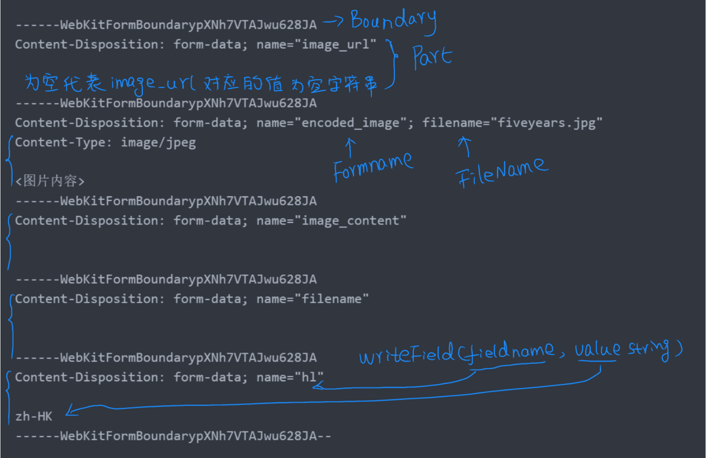

# mime/multipart 基本使用

mutipart 实现了 MIME 的 mutipart 解析，可参见[RFC 2046](http://tools.ietf.org/html/rfc2046)。该实现适用于 HTTP 和常见浏览器生成的 mutipart 主体

## File

```go
type File interface {
    io.Reader
    io.ReaderAt
    io.Seeker
    io.Closer
}
```

File 是一个接口，实现了对一个 multipart 信息中文件记录的访问。它的内容可以保持在内存中或者硬盘里，如果保持在硬盘中，那么底层类型将会是\*os.File。

## FileHeader

```go
type FileHeader struct {
	Filename string
	Header   textproto.MIMEHeader
	Size     int64
	// contains filtered or unexported fields
}
```

FileHeader 描述了一个 multipart 请求的一个文件信息

`func (fh *FileHeader) Open() (File, error)`

Open 方法打开并返回 FileHeader 关联的文件

##  Form
```go
type Form struct {
	Value map[string][]string
	File  map[string][]*FileHeader
}
```
Form是一个解析过的multipart表单。它的File参数部分保存在内存或者硬盘上，可以使用*FileHeader类型属性值的Open方法访问。它的Value 参数部分保存为字符串，两者都以属性名为键。

`func (f *Form) RemoveAll() error`

RemoveAll 函数删除所有于Form相关联的临时文件

## Part

```go
type Part struct {
	// The headers of the body, if any, with the keys canonicalized
	// in the same fashion that the Go http.Request headers are.
	// For example, "foo-bar" changes case to "Foo-Bar"
	Header textproto.MIMEHeader
	// contains filtered or unexported fields
}
```

Part 代表 multipart 主体的一个单独的记录

`func (p *Part) Close() error`
(文档中无解释)

`func (p *Part) FileName() string`

FileName 返回 Part 中 Content-Disposition 头部对应的 filename 参数

`func (p *Part) FormName() string`

如果 p 的 Content-Dispotition 值为"form-data"，FormName 返回对应的 name 参数值，否则返回空字符串

`func (p *Part) Read(d []byte) (n int, err error)`

Read 读取一个记录的主体，也就是从头部后到下一部分开始的内容

## Reader

```go
type Reader struct {
	// contains filtered or unexported fields
}
```

Reader 是一个包含 MIME multipart 中所有内容的迭代器。 Reader 底层的解析器在需要的时候读取输入，不支持 Seek

`func NewReader(r io.Reader, boundary string) *Reader`

NewReader 用所给的 MIME boundary 创建一个新的从 r 中读取 multipart 的读取器

该 boundary 通常从 Content-Type 中的 boundary 参数获取，使用 mime.ParseMediaType 可以解析这样的头部内容

`func (r *Reader) NextPart() (*Part, error)`

NextPart 返回 multipart 中的下一部分或者一个错误，当没有更多的内容时会返回一个 io.EOF 错误

在特殊情况下，如果"Content-Transfer-Encoding" 头部有个值为"quoted-printable"，那么头部会被隐藏，但是body在读取的时候会隐式的解码

`func (r *Reader) NextRawPart() (*Part, error)`

不像NextPart，它不会对"Content-Transfer-Encoding: quoted-printable"进行特殊处理

`func (r *Reader) ReadForm(maxMemory int64) (*Form, error)`

ReadForm 解析整个multipart内容中Content-Disposition为form-data的记录。它会把最多maxMemory+10MB(为非文件部分保存)字节保存在内存里，其余的保存在硬盘的临时文件中。如果所有的非文件部分不能被保存在内存中，会返回ErrMessageTooLarge错误

## Writer
```go
type Writer struct {
	// contains filtered or unexported fields
}
```
Writer可以产生multipart信息

`func NewWriter(w io.Writer) *Writer`

NewWriter返回一个新的含有随机boundary 的multipart Writer，所有的内容会写入到w中

`func (w *Writer) Boundary() string`

Boundary 返回Writer的boundary

`func (w *Writer) Close() error`

Close 完成multipart信息，并且把末尾的边界写入到输出中


`func (w *Writer) CreateFormField(fieldname string) (io.Writer, error)`

CreateFormField使用给定的属性名调用CreatePart方法

`func (w *Writer) CreateFormFile(fieldname, filename string) (io.Writer, error)`

CreateFormFile是一个更加方便使用的CreatePart的包装，使用所给的属性名和文件名创建一个新的form-data头

`func (w *Writer) CreatePart(header textproto.MIMEHeader) (io.Writer, error)`

CreatePart 使用所给的header创建一个新的mutipart记录，记录的内容应该写入到返回的Writer中。在调用CreatePart后，之前的记录都不能在被写入了

`func (w *Writer) FormDataContentType() string`

FormDataContentType 方法返回w对应的HTTP multipart/form-data请求的Content-Type的值

`func (w *Writer) SetBoundary(boundary string) error`

SetBoundary使用显式的值覆盖Writer随机产生的boundary分隔符

SetBoundary 必须在记录创建之前调用，且只能包括某些特定的ASCII字符，而且非空，且长度最长为70

`func (w *Writer) WriteField(fieldname, value string) error`

WriteField 调用CreateFormField，然后写入给定的值
<hr/>

部分结构可以参考下图：
